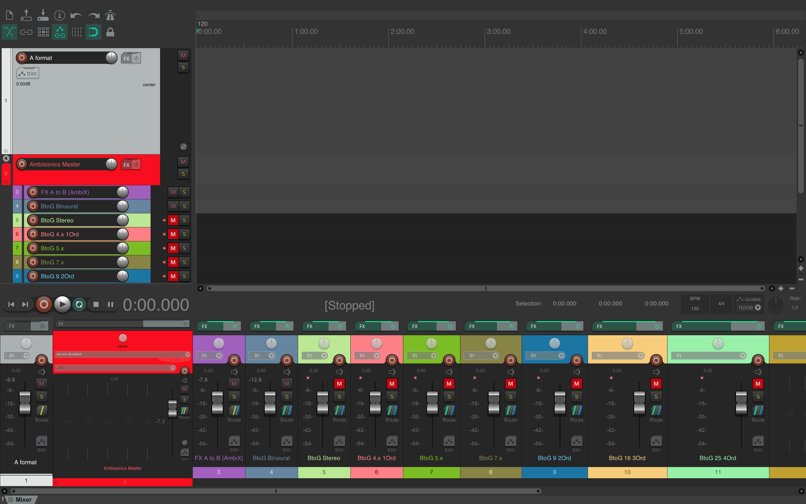
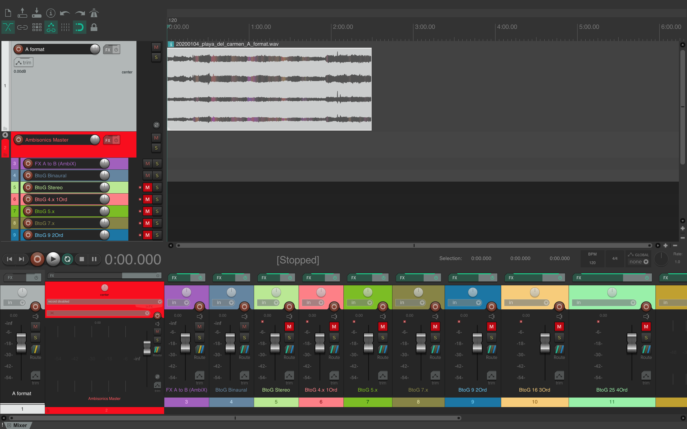

# ssfr_open_archive_tutorial
This tutorial is part of the [Spatial Sound Recordings Open Archive](https://archive.org/details/spatial-sound-open-archive). 

Here you will find a short introduction on how to work and export 1st order ambisonic recordings in Reaper. I share the same workflow I use in my artistic work as I have found it to be flexible for different rendering situations. 
This tutorial assumes that you have a basic knowledge of audio editing and you want to expand your skills with ambisonic spatial sound recordings.

## Content
1. DAW - Reaper 
2. VST Plug-Ins
    1. Aalto SPARTA
    2. IEM Ambisonic Plug-in Suite
3. Project file
    1. Download
    2. Loading
    3. Navigation
    4. Project's Audio Chain
    5. Adding an A-Format file
    6. The Ambisonic Master
    7. FX & A-B Encoder track  
    8. G Format Decoding tracks
    9. Rendering
4. References
5. Support

## DAW - Reaper
I use Reaper because it offers a really easy configuration of multichannel tracks. Some of the features that make multichannel work flexible are:
* Automatic creation of multichannel tracks when importing multichannel sound files.
* Up to 64 channel audio tracks.
* Drag & Drop routing.
* Easy hardware multichannel output mapping.
* Possibility to edit JSFX plug-ins with multichannel inputs and outputs.

Although Reaper is not open-source, it offers a 60$ full-feature licence for individuals, educational and non-profit organizations. Its evaluation license is also full-feature, lasts 60 days and it will let use the software after those 60 days if you are ok with a little reminder to buy a license. 

**Download**

Reaper works on macOs, Windows and Linux. You can download your system version [here](https://www.reaper.fm/download.php).

## VST Plug-ins
There are different ambisonic plug-ins out there. However, I have found that the ones I get the best configurations and sound from are the Aalto SPARTA VST and the IEM Ambisonic Plug-in Suite. Both of them are open-source and offer support for macOs, Windows and Linux. 

### Aalto SPARTA
Aalto SPARTA offers different VST plugins for encoding, decoding, transforming, visualisation and upmixing. 

A full list and description of each plug-in can be found [here](http://research.spa.aalto.fi/projects/sparta_vsts/plugins.html)

I especially like the sparta_ambiDEC decoder. It offers different degrees of decoding order per frequency band and it provides real-time binaural listening of your multichannel speaker set-up. This decoder also comes with numerous speaker layouts presets. 

**Download**

Download your system version of SPARTA [here](http://research.spa.aalto.fi/projects/sparta_vsts/).

### IEM Ambisonic Plug-in Suite
The IEM Plug-in Suite also offers many spatial tools such as encoders, decoders, rotators and visualisers among others. Withal, what I like about this suite are its audio editing tools such as a multichannel equaliser, ambisonic compressors and ambisonic delay and reverb. 

The IEM suit has a fantastic [documentation](https://plugins.iem.at/docs/) with installation guides, detailed plug-in descriptions, a reaper tutorial, a specific guide for some of their spatial tools. 

**Download**

Download your system version of IEM Plug-in Suite [here](https://plugins.iem.at/download/).

The IEM team has its own [installation guide](https://plugins.iem.at/docs/installation/) for Reaper.

### Reaper's gfxanalyzer_4ch
Reaper has its own JSFX FFT Spectrum Analyzer. However, the default version is only 2ch. Since we are working with 1st order ambisonic recordings, we need a 4ch FFT Spectrum Analyzer. In this repository you can find Reaper's JSFX FFT Spectrum Analyzer with a little modification that allows for 4ch input. 

**Download**

Download the this repository as .zip from [here](https://github.com/krrnk/ssfr_open_archive_tutorial/archive/main.zip) or by cloning this repository:

`git clone https://github.com/krrnk/ssfr_open_archive_tutorial.git`

**Installation**
Inside the downloaded repository, you will find the file "gfxanalyzer_4ch". Copy this file to the directory where Reaper locates its JS Plugin-ins. 

1. Open Reaper.
2. In the <kbd>Options</kbd> menu choose <kbd>Show REAPER resource path in explorer/finder</kbd>
3. Locate the Effects directory in the file explorer.
4. Inside /Effects/ you will see a folder called "analysis"
5. Copy the file gfxanalyzer_4ch into the /analysis/ folder.

Terminal alternative in macOS:

`cp PATH_TO_PARENT_DIRECTORY/ssfr_open_archive_tutorial/gfxanalyzer_4ch ~/Library/Application\ Support/REAPER/Effects/analysis/`

Where PATH_TO_PARENT_DIRECTORY is the path to the folder where this repository is located. For example ~/Downloads/   

## Project file
### Loading
Locate this repository on your computer. Open the folder and you will see the file "SSFR_Open_Archive_Ambisonic_Template_Editing.RPP".

Double click on it to open it.

### Navegation
#### General view
Once the project has loaded you should have a general view like this:

#### Locating the plugins
By default, Reaper looks for plug-ins in the general plug-in folder. 

If you have installed the plug-ings in a particular folder or they don't show up on the start you need to tell Reaper where they are. 

To do it, go Reaper Preferences, scroll to Plug-ins and click on <kbd>VST</kbd>. Next to the current plug-ins paths, click on <kbd>Edit...</kbd>, then click on <kbd>Add...</kbd> and look for the folder where you install your plugins. Select that folder. Back in the Preferences/Plug-ins/VST press on <kbd>Re-scan</kbd>. Finally click on <kbd>Apply</kbd>.

#### Audio tracks
The project counts with 14 tracks.
* Track 1: A-Format recordings track.
* Track 2: Ambisonic Master track. **This is the only track with hardware outputs.** This track is also the parent of all the other ambisonic tracks.
* Track 3: FX track and the encoder from A-Format to B-Format.
* Tracks 4 - 14: These tracks are all decoders from binaural (track 4) and stereo (track 5) to 1st Order (track 6) until 7th Order (track 14).

By default, tracks 5-14 are muted to save CPU. 

### Project's Audio Chain
A-Format -> FX & Encoder Track -> Decoders -> Ambisonic Master -> Hardware Outputs 

### Adding an A-Format recording
You can explore the A-Format recordings of the Spatial Sound Field Recording Open Archive [here](https://archive.org/details/spatial-sound-open-archive-a-format/). The recordings are in .WAV 16-Bit/44.1 kHz.

You can [download all the files](https://archive.org/compress/spatial-sound-open-archive-a-format/formats=WAVE,ITEM%20TILE,ARCHIVE%20BITTORRENT,METADATA) or download just one by clicking on DOWNLOAD OPTIONS/WAVE and pressing the download icon of the file you want. 

Once you have the A-Format recording you want to work on, drag it to the A-Format track in the Reaper project. 

Now your project should look similar to this:

If you press <kbd>↩</kbd> you should already hear a binaural render of the A-Format recording as it is the only active decoding track.

When I edit, I barely touch the A-Format track apart from cutting, normalising or trimming the Pre-FX Volume. 

Some shortcuts that are useful:
* Split: <kbd>s</kbd>
* Split within time selection: <kbd>shift</kbd> + <kbd>S</kbd>
* Cut within time selection: <kbd>ctrl</kbd>/<kbd>cmd</kbd> + <kbd>shift</kbd> + <kbd>⌃⇧X</kbd> / 
* Normalize: <kbd>ctrl</kbd>/<kbd>cmd</kbd> + <kbd>shift</kbd> + <kbd>⌃⇧N</kbd> / 
* Item properties: <kbd>F2</kbd> 

### The Ambisonic Master
This track is the parent of the following FX and decoding tracks. 

#### Routing
All the decoders have the <kbd>parent send</kbd> active. Consequently, they route their output to the Ambisonic Master track. 

The hardware outputs in this track are set to 64ch. You can check this by clicking on the <kbd>Route</kbd> button and looking for Audio Hardware Outputs.

In my case, I only use this track for monitoring, output and rendering. 

### The FX & A-B Encoder track 
This track contains the effect chain and an encoder from A-Format to B-Format. 

The FX chain in this track follows this path:
Frequency Spectrum Analyzer -> Multichannel EQ -> Frequency Spectrum Analyzer -> Ambisonic Encoder A-B (AmbiX) -> (Bypassed) Ambisonic OmniCompressor -> (Bypassed) Ambisonic MultiBandCompressor -> (Bypassed) Ambisonic Energy Visualizer.

#### Why this order?
> "Spatial information is encoded in balance and phase relations between the four channels of a B-format signal. Processing one or more of the B-format channels using an audio effect which modifies gain and phase relations will most likely disrupt or otherwise distort the encoded spatial information." [1] 

Therefore, if we work with non-ambisonic plugins, these should be placed before the encoder. In this case, the Frequency Spectrum Analyzer and the Multichannel EQ are normal audio plug-ins so they go before encoding the signal. In contrast, the IEM compressors and visualizer expect an ambisonic signal as input and thus they are placed after the encoder. 

#### Why these effects?

I tend to avoid heavy editing of sound field recordings. For this reason, in this template, I provide basic editing tools and it is up to the user to add more.

Since the multichannel EQ does not offer graphical output, I place A 4ch frequency spectrum analyzer before and after the Multichannel EQ to double-check my changes.

I leave the compressors bypassed as they are not always needed. I tend to use them only and if necessary I use the Omnicompressor and Multiband compressor simultaneously. Notice that the IEM Plug-in Suite also offers an Ambisonic Directional Compressor. 

The Visualiser is bypassed by default to save CPU power. 

#### B-Format encoding
There are different encoding conventions for Ambisonics. These encoding conventions refer to the channel ordering of the B-Format signal and the normalization function applied to the signal. Both the SPARTA and IEM suite used the ACN ordering SN3D normalisation by default, which are standard when working with High Order Ambisonics [2]. C. Nachbar et al. offered a comparison between FUMA and ACN when they proposed the encoding format AmbiX [3].

### The G-Format decoding tracks
These are the tracks that offer different decoding formats. 

If you wish to use subwoofers with these decoders you need to make your own subwoofer buses. As the use and number of subwoofers depend on each scenario, I left this decision to the user.

Most of the decoders use SPARTA AmbiDEC because they offer the option to binauralise the loudspeakers and to select the amount of diffusion and directionality per frequency band. However, IEM's AIIRA Decoder sounds good too and it offers a really clear interface to create custom loudspeaker configurations. 

* Track 4 BtoG Binaural: Binaural decoder. By default, it uses the SPARTA AmbiBIN. But Aalto's COMPASS binaural decoder and IEM's Binaural decoder are also included. IEM's decoder includes different headphone equalisation, which is useful for comparing different binaural mixes and exporting for a particular headphone scenario. 
* Track 5 BtoG Stereo: IEM's Simple Decoder with a Mid-Side decoding configuration preset.
* Track 6 BtoG 4.x 1Ord: 1st Order ambisonic decoder with a quadrophonic setup using SPARTA AmbiDEC.
* Track 7 BtoG 5.x: Decoder for 5.x surround systems using SPARTA AmbiDEC. 
* Track 8 BtoG 7.x: Decoder for 7.x surround systems using SPARTA AmbiDEC. 
* Tracks 9-14 BtoG: These tracks offer decoding options for ambisonic orders 2-7 respectively. They all use Aalto's COMPASS Upmixer to create imaginary channels out of your 1st order recording. Each of them has a particular loudspeaker spherical configuration related to the ambisonic order. The COMPASS Upmixer is optional and you might want to bypass if you hear artefacts in the decoding. 

### Rendering
In order to render any of the decoding tracks, select the Ambisonic Master track by clicking on it and press <kbd>cmd</kbd>/<kbd>ctrl</kbd> + <kbd>alt</kbd> + <kbd>R</kbd>. 

On the window dialog, look at the top-left where it says <kbd>source:</kbd>. Select <kbd>Stems (selected tracks)</kbd>. 

After that select the output directory for your project. 

In the <kbd>Options</kbd> at the middle of the window, make sure that <kbd>Multichannel tracks to multichannels files</kbd> is checked. 

Select WAV as the output format.

Finally press <kbd>Render</kbd>

Enjoy your spatial sound recording!

## References

[1]: Lossius, T., & Anderson, J. (2014). ATK reaper: The ambisonic toolkit as JSFX plugins. Proceedings - 40th International Computer Music Conference, ICMC 2014 and 11th Sound and Music Computing Conference, SMC 2014 - Music Technology Meets Philosophy: From Digital Echos to Virtual Ethos, 1338–1345.

[2]: Politis, A., & Poirier-quinot, D. (2016). JSAmbisonics : A Web Audio library for interactive spatial sound processing on the web. Interactive Audio Systems Symposium.

[3]: Nachbar, C., Zotter, F., Deleflie, E., & Sontacchi, A. (2011). Ambix - A Suggested Ambisonics Format. International Symposium on Ambisonics and Spherical Acoustics, 3, 1–11.

## Support
This project has been supported by The Arts Promotion Centre Finland (Taike) 

## Contact
[camilo@konvolv.com](mailto:camilo@konvolv.com)